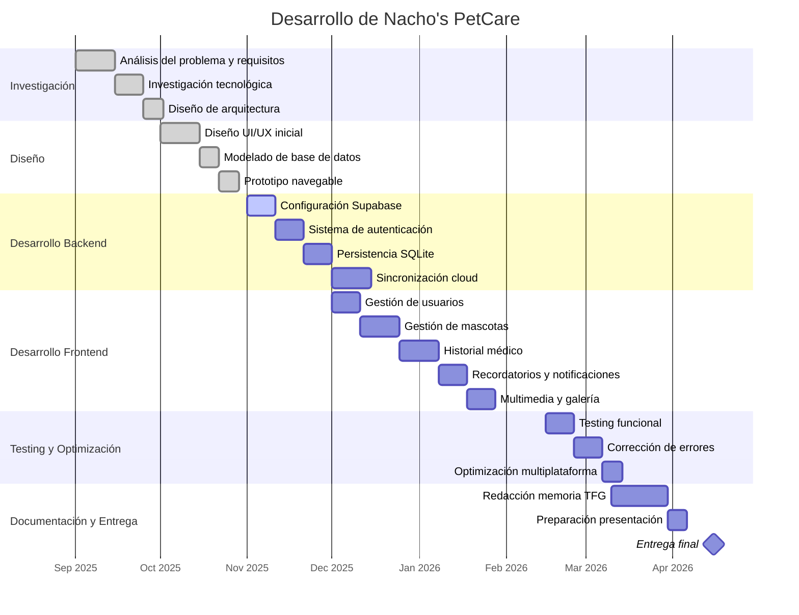

🐾 Nacho's PetCare 🐾

[](https://flutter.dev)
[](https://dart.dev)
[](https://www.android.com)
[](https://www.apple.com/ios)
[](https://www.microsoft.com/windows)
[](LICENSE)

> **Aplicación multiplataforma para la gestión integral de mascotas**

Una solución digital completa que centraliza toda la información de cuidado de tus mascotas en un único lugar, con sincronización en la nube y funcionamiento offline garantizado.

## 📸 Capturas de Pantalla

### 🚀 Splash Screen y Pantalla de Inicio

<p align="center">
  
  
</p>

---

### 🏠 Dashboard Principal

<p align="center">
  
</p>

---

### 🐾 Gestión de Mascotas

#### 📋 Listado de Mascotas

<p align="center">
  
</p>

#### 🐶 Perfil de Mascotas

<p align="center">
  
  
  
</p>

<p align="center">
  
  
</p>

---

### 🔔 Recordatorios

<p align="center">
  
</p>

---

### 🌍 Comunidad y Directorio

#### 🐾 Comunidad

<p align="center">
  
</p>

#### 🏡 Animales en Adopción

<p align="center">
  
</p>

#### 📚 Artículos Informativos

<p align="center">
  
</p>

#### 🏥 Directorio Profesional

<p align="center">
  
</p>

---

### 👤 Perfil y Configuración

<p align="center">
  
  
</p>

---

---

## 🎯 Descripción del Proyecto

**Nacho's PetCare** es un Trabajo de Fin de Grado del Ciclo Formativo de Grado Superior en **Desarrollo de Aplicaciones Multiplataforma (DAM)**, realizado en el curso 2025/26.

### Problema Identificado

En España hay más de **29 millones de mascotas registradas** y el sector mueve en torno a **1.500 millones de euros anuales**. Sin embargo, la gran mayoría de propietarios de animales de compañía continúa gestionando la información de manera fragmentada y analógica:

- 📓 Libretas veterinarias en papel
- 📱 Recordatorios perdidos en el calendario del teléfono
- 📸 Fotos dispersas entre diferentes aplicaciones
- 📄 Recetas y diagnósticos acumulados sin orden

**Consecuencias concretas:**
- ❌ 28% de propietarios retrasan las vacunas
- ❌ Más del 30% no sigue correctamente los refuerzos recomendados
- ❌ Pérdida de historial médico al cambiar de veterinario
- ❌ Imposibilidad de aportar información clínica en urgencias

### Propuesta de Valor

Nacho's PetCare resuelve este problema ofreciendo:

✅ **Centralización completa** - Toda la información en un único lugar
✅ **Multiplataforma nativa** - Android, iOS y escritorio (Windows, Linux, macOS)
✅ **Funcionamiento offline** - Funciona sin conexión a internet
✅ **Sincronización en la nube** - Tus datos siempre actualizados
✅ **Interfaz intuitiva** - Fácil de usar para cualquier persona
✅ **Gratuito** - Versión base completamente gratuita

---

## 🛠️ Stack Tecnológico

### Frontend
[](https://flutter.dev)
[](https://dart.dev)

### Base de Datos
[](https://www.sqlite.org)
[](https://supabase.com)

### Backend & APIs
[](https://supabase.com)

### Plataformas Soportadas
[](https://www.android.com)
[](https://www.apple.com/ios)
[](https://www.microsoft.com/windows)
[](https://www.linux.org)
[](https://www.apple.com/macos)

### Herramientas de Desarrollo
- **IDE:** Android Studio / VS Code / IntelliJ IDEA
- **Control de versiones:** Git / GitHub
- **CI/CD:** GitHub Actions
- **Autenticación:** Firebase Authentication / Google Sign-In

---

## ✨ Características Principales

### v1.0 - Funcionalidades Incluidas

#### 👤 Gestión de Usuario
- ✅ Autenticación con email y contraseña
- ✅ Registro seguro de nuevas cuentas
- ✅ Login con Google Sign-In
- ✅ Gestión de perfil de usuario
- ✅ Recuperación de contraseña

#### 🐕 Gestión de Mascotas
- ✅ Registro de múltiples mascotas por cuenta
- ✅ Perfiles detallados por mascota (nombre, raza, edad, peso, etc.)
- ✅ Foto de perfil de cada mascota
- ✅ Historial médico completo

#### 🏥 Historial Médico-Veterinario
- ✅ Registro de vacunas y fechas de aplicación
- ✅ Control de desparasitaciones
- ✅ Registro de visitas veterinarias
- ✅ Gestión de medicaciones y dosis
- ✅ Registro de diagnósticos y tratamientos
- ✅ Notas generales de salud

#### 📅 Recordatorios y Notificaciones
- ✅ Recordatorios automáticos configurables
- ✅ Notificaciones push locales
- ✅ Avisos de próximas citas
- ✅ Alertas de medicamentos

#### 📸 Gestión de Multimedia
- ✅ Subida de fotos desde cámara
- ✅ Importar fotos desde galería
- ✅ Galería de fotos por mascota
- ✅ Almacenamiento en la nube

#### 📊 Panel de Control
- ✅ Vista resumen por mascota
- ✅ Próximos eventos y recordatorios
- ✅ Estadísticas de salud
- ✅ Búsqueda y filtrado de registros

#### 🔄 Sincronización y Datos
- ✅ Funcionamiento completamente offline
- ✅ Sincronización automática en la nube
- ✅ Persistencia de datos local con SQLite
- ✅ Backup automático en Supabase
- ✅ Exportación de datos

### Fuera del Alcance v1.0

- ❌ Integración con clínicas veterinarias externas
- ❌ Comercio electrónico de productos
- ❌ Mensajería en tiempo real entre usuarios
- ❌ Seguimiento GPS de mascotas
- ❌ Integración con wearables/collares inteligentes

---

## 📋 Requisitos Previos

### Para Desarrollo

#### Windows
- **Flutter SDK:** 3.x o superior
- **Dart SDK:** 3.x o superior
- **Android Studio:** Última versión
- **Java JDK:** 17 o superior
- **Git:** 2.40 o superior
- **Visual Studio:** 2022 Community (para soporte desktop)
- **Espacio en disco:** Mínimo 10 GB

#### macOS
- **Xcode:** 14.0 o superior
- **Flutter SDK:** 3.x o superior
- **Dart SDK:** 3.x o superior
- **CocoaPods:** 1.11 o superior
- **Ruby:** 2.7 o superior

#### Linux
- **Flutter SDK:** 3.x o superior
- **Dart SDK:** 3.x o superior
- **CMake:** 3.10 o superior
- **pkg-config:** 0.29 o superior
- **GTK 3.0:** Desarrollo libraries

### Cuentas Necesarias

- 🔐 **Firebase Console** - Para autenticación
- ☁️ **Supabase** - Para backend y sincronización
- 📱 **Google Cloud Console** - Para Google Sign-In
- 🔑 **Google Play Console** - Para publicar en Android
- 🍎 **Apple Developer Account** - Para iOS

---

## 📅 Cronología de Desarrollo

### Planificación del Proyecto (TFG DAM 2025/26)



### 📌 Estado Actual del Proyecto

| Módulo | Estado |
|---|---|
| Arquitectura base | ✅ Completado |
| Autenticación | ✅ Completado |
| Gestión de mascotas | ✅ Completado |
| Historial médico | 🚧 En desarrollo |
| Notificaciones | 🚧 En desarrollo |
| Sincronización cloud | 🚧 En desarrollo |
| Testing multiplataforma | ⏳ Pendiente |
| Publicación y despliegue | ⏳ Pendiente |

### 🎯 Objetivo de la planificación

La planificación del proyecto sigue una metodología incremental orientada al desarrollo multiplataforma con Flutter, priorizando primero la arquitectura base y posteriormente las funcionalidades críticas relacionadas con la gestión sanitaria y documental de mascotas.

El objetivo principal es garantizar:
- Escalabilidad del sistema
- Persistencia local y sincronización cloud
- Compatibilidad multiplataforma
- Experiencia de usuario intuitiva
- Funcionamiento offline-first

---

## 🚀 Instalación y Configuración

### 1. Clonar el Repositorio

```bash
git clone https://github.com/cgonzalezcouso/Nachos.PetCare.git
cd nachos_pet_care_flutter
```

### 2. Instalar Dependencias de Flutter

```bash
flutter pub get
```

### 3. Configurar Firebase y Supabase

#### Crear archivo `lib/config/secrets.dart`

```dart
// lib/config/secrets.dart
class AppSecrets {
  static const String supabaseUrl = 'https://your-project.supabase.co';
  static const String supabaseAnonKey = 'your-anon-key';
  static const String googleWebClientId = 'your-web-client-id';
  static const String googleAndroidClientId = 'your-android-client-id';
}

final appSecrets = AppSecrets();
```

**⚠️ IMPORTANTE:** Este archivo NO debe ser commiteado. Está incluido en `.gitignore`.

### 4. Descargar google-services.json

1. Ve a [Firebase Console](https://console.firebase.google.com)
2. Selecciona tu proyecto
3. Descarga el archivo `google-services.json`
4. Colócalo en `android/app/google-services.json`

---

## 📱 Instalación en Android

### Opción 1: Compilar APK en Desarrollo

```bash
# Build APK debug
flutter build apk --debug

# Build APK release
flutter build apk --release

# Build App Bundle (Google Play)
flutter build appbundle --release
```

El APK se generará en: `build/app/outputs/flutter-apk/`

### Opción 2: Instalar en Dispositivo Conectado

```bash
# Listar dispositivos disponibles
flutter devices

# Instalar y ejecutar
flutter run

# Instalar build específico
flutter install --release
```

### Opción 3: Descargar APK Precompilado

Ve a la sección [Releases](https://github.com/cgonzalezcouso/Nachos.PetCare/releases) del repositorio y descarga la última versión compilada.

### Instalación Manual en Dispositivo

1. Descarga el archivo `app-release.apk`
2. Transfiere a tu dispositivo Android
3. Abre el archivo y presiona "Instalar"
4. Acepta los permisos solicitados

**⚠️ Nota:** Asegúrate de permitir instalación desde fuentes desconocidas en tu dispositivo.

---

## 💻 Instalación en Windows (Escritorio)

### Requisitos Previos

```bash
# Verificar que el soporte a Windows esté habilitado
flutter config --enable-windows-desktop

# Verificar dispositivos
flutter devices
```

### Compilación

```bash
# Build Windows Release
flutter build windows --release

# El ejecutable se encontrará en:
# build/windows/runner/Release/nacho_pet_care.exe
```

### Instalación

#### Método 1: Ejecutar Directamente

```bash
# Navegar a la carpeta
cd build/windows/runner/Release

# Ejecutar la aplicación
./nacho_pet_care.exe
```

#### Método 2: Crear Acceso Directo

1. Copia el archivo `nacho_pet_care.exe`
2. Crea un acceso directo en tu Escritorio
3. Haz doble clic para ejecutar

#### Método 3: Instalador MSI (Opcional)

Para crear un instalador profesional:

```bash
# Instalar herramientas necesarias
choco install create-appx-package

# Crear MSIX (instalador moderno)
flutter build windows --release
```

### Integración con el Menú de Inicio

El ejecutable se puede anclar al menú de Inicio de Windows mediante:

1. Click derecho sobre `nacho_pet_care.exe`
2. Selecciona "Anclar a Menú de Inicio"

---

## 🔧 Desarrollo Local

### Estructura del Proyecto

```
nachos_pet_care_flutter/
├── lib/
│   ├── config/
│   │   ├── secrets.dart          # Configuración de credenciales (no commitar)
│   │   └── supabase_config.dart  # Configuración de Supabase
│   ├── models/                   # Modelos de datos
│   ├── screens/                  # Pantallas de la aplicación
│   ├── services/                 # Servicios (API, BD, autenticación)
│   ├── widgets/                  # Widgets reutilizables
│   └── main.dart                 # Punto de entrada
├── android/                      # Configuración específica de Android
├── ios/                          # Configuración específica de iOS
├── windows/                      # Configuración específica de Windows
├── web/                          # Configuración para web
├── test/                         # Tests unitarios e integración
├── pubspec.yaml                  # Dependencias del proyecto
└── README.md                     # Este archivo
```

### Ejecutar en Modo Desarrollo

```bash
# En dispositivo/emulador Android
flutter run

# Con hot reload y logs detallados
flutter run -v

# En Windows (escritorio)
flutter run -d windows

# En navegador (si está habilitado)
flutter run -d chrome
```

### Análisis de Código

```bash
# Análisis estático
flutter analyze

# Formatear código
dart format .

# Verificar problemas
flutter analyze --suggestions
```

### Tests

```bash
# Ejecutar todos los tests
flutter test

# Test con cobertura
flutter test --coverage

# Test específico
flutter test test/unit/example_test.dart
```

---

## 🔐 Configuración de Credenciales

### Variables de Entorno Necesarias

```bash
SUPABASE_URL=https://your-project.supabase.co
SUPABASE_ANON_KEY=your-anon-key
GOOGLE_WEB_CLIENT_ID=your-web-client-id
GOOGLE_ANDROID_CLIENT_ID=your-android-client-id
FIREBASE_PROJECT_ID=your-project-id
```

### GitHub Secrets (para CI/CD)

Configura en tu repositorio GitHub:

1. **Settings → Secrets and variables → Actions**
2. Añade los siguientes secrets:

```
SUPABASE_URL
SUPABASE_ANON_KEY
GOOGLE_WEB_CLIENT_ID
GOOGLE_ANDROID_CLIENT_ID
GOOGLE_SERVICES_JSON      # Contenido completo del archivo JSON
```

---

## 🤖 CI/CD con GitHub Actions

El proyecto incluye automatiación completa con **GitHub Actions**:

- ✅ Análisis estático automático
- ✅ Ejecución de tests
- ✅ Compilación de APK
- ✅ Subida de artefactos

Workflow disponible en: `.github/workflows/flutter-ci.yml`

### Ver Estado de Workflows

Ve a la pestaña **Actions** de tu repositorio GitHub para ver:

- Builds exitosos
- Logs detallados
- APKs generados

---

## 📊 Estructura de Datos

### Modelos Principales

#### Usuario
```dart
User {
  id: String,
  email: String,
  nombre: String,
  apellidos: String,
  fotoPerfil: String?,
  fechaRegistro: DateTime,
  ultimoAcceso: DateTime
}
```

#### Mascota
```dart
Pet {
  id: String,
  userId: String,
  nombre: String,
  raza: String,
  tipo: String (perro, gato, etc),
  fechaNacimiento: DateTime,
  peso: double,
  color: String,
  foto: String?,
  microchip: String?,
  fechaRegistro: DateTime
}
```

#### Evento de Salud
```dart
HealthEvent {
  id: String,
  petId: String,
  tipo: String (vacuna, desparasitación, etc),
  fecha: DateTime,
  proximaFecha: DateTime?,
  descripcion: String,
  veterinario: String?,
  medicamento: String?,
  notas: String?
}
```

---

## 🌐 Sincronización en la Nube

### Supabase Setup

1. Crear proyecto en [Supabase](https://supabase.com)
2. Crear tablas:
   - `users`
   - `pets`
   - `health_events`
   - `photos`

3. Configurar Row Level Security (RLS)
4. Obtener URL y anon key
5. Configura en `lib/config/secrets.dart`

### Funcionamiento Offline

- Los datos se guardan en **SQLite** localmente
- Cuando hay conexión, se sincronizan automáticamente con Supabase
- La aplicación funciona completamente sin internet

---

## 🐛 Solución de Problemas

### Error: "flutter: command not found"

```bash
# En Windows, ejecuta Flutter SDK setup
flutter doctor

# Añade Flutter al PATH (Windows):
setx PATH "%PATH%;C:\flutter\bin"
```

### Error: "Android SDK not found"

```bash
# Descargar Android SDK
flutter config --android-sdk-path "C:\Android\sdk"

# En macOS
flutter config --android-sdk-path ~/Library/Android/sdk
```

### Error: "Gradle task assembleDebug failed"

```bash
# Limpiar caché de Gradle
cd android
./gradlew clean
cd ..

flutter clean
flutter pub get
flutter build apk --debug
```

### Error: "CocoaPods not installed" (macOS)

```bash
# Instalar CocoaPods
sudo gem install cocoapods
cd ios
pod install
cd ..
```

### Los datos no se sincronizan

```bash
# Verificar conexión a internet
# Comprobar credenciales de Supabase en secrets.dart
# Revisar permisos RLS en Supabase

# Forzar re-sincronización
# Ir a Ajustes → Sincronizar datos
```

---

## 📈 Rendimiento y Optimizaciones

### Tamaño de APK

- **APK Debug:** ~150 MB
- **APK Release:** ~40-50 MB

### Consumo de Memoria

- **Mínimo:** ~50 MB
- **Típico:** ~120-150 MB
- **Máximo:** ~300 MB

### Requisitos de Red

- **Conexión:** Mínimo 1 Mbps recomendado
- **Datos:** ~5-10 MB por mes en uso normal

---

## 📚 Documentación Adicional

- 📖 [Documentación de Flutter](https://flutter.dev/docs)
- 📖 [Documentación de Dart](https://dart.dev/guides)
- 📖 [Documentación de Supabase](https://supabase.com/docs)
- 📖 [Documentación de Firebase](https://firebase.google.com/docs)

---

## 👤 Autor

**Cristian Gonzalez Couso**

- 📧 Email: [cristian.gonzalez.couso@students.thepower.education]
- 💼 LinkedIn: [https://www.linkedin.com/in/cristian-gonzalez-couso/]
- 🐙 GitHub: [@cgonzalezcouso](https://github.com/cgonzalezcouso)

---

## 👩‍🏫 Tutora

**Olga Moreno**

Tutora del Trabajo de Fin de Grado en el CFGS de Desarrollo de Aplicaciones Multiplataforma.

---

## 📜 Licencia

Este proyecto está bajo la licencia **MIT**. Ver archivo [LICENSE](LICENSE) para más detalles.

```
Copyright (c) 2025 Cristian González Couso

Permission is hereby granted, free of charge, to any person obtaining a copy
of this software and associated documentation files (the "Software"), to deal
in the Software without restriction...
```

---

## 🙏 Dedicatoria

*"Dedicado a todas las mascotas que han pasado por mi vida, pero especialmente a Nacho, que me enseñó que fue un gran luchador hasta el final y que sé que donde esté me espera para reencontrarnos.*

*Para mi madre, que con todo su esfuerzo ha promovido que estudie y sea algo en la vida.*

*Por último, para mi compañera de vida que ha estado a mi lado y me ha animado a ir por el trabajo que quiero y seguir desarrollándome profesionalmente."*

---

## 🤝 Contribuciones

Las contribuciones son bienvenidas. Por favor:

1. Fork el repositorio
2. Crea una rama para tu feature (`git checkout -b feature/AmazingFeature`)
3. Commit tus cambios (`git commit -m 'Add some AmazingFeature'`)
4. Push a la rama (`git push origin feature/AmazingFeature`)
5. Abre un Pull Request

---

## 📞 Soporte

¿Encontraste un bug? ¿Tienes una sugerencia?

- 🐛 [Reportar bug](https://github.com/cgonzalezcouso/Nachos.PetCare/issues)
- 💡 [Solicitar feature](https://github.com/cgonzalezcouso/Nachos.PetCare/discussions)
- 📧 Contacta directamente al autor

---

**⭐ Si este proyecto te fue útil, considera darle una estrella en GitHub ⭐**

---

*Última actualización: Enero 2025*
*Versión: 1.0.0*
