# 🐾 Nacho's PetCare 🐾

[](https://flutter.dev)
[](https://dart.dev)
[](https://www.android.com)
[](https://www.apple.com/ios)
[](https://www.microsoft.com/windows)
[](LICENSE)

> **Aplicación multiplataforma para la gestión integral de mascotas**

Una solución digital completa que centraliza toda la información de cuidado de tus mascotas en un único lugar, con sincronización en la nube, funcionamiento offline y nuevas funciones sociales, multidioma y de monetización en la versión 2.0.

## 📸 Capturas de Pantalla

### 🚀 Splash Screen y Pantalla de Inicio

<p align="center">
  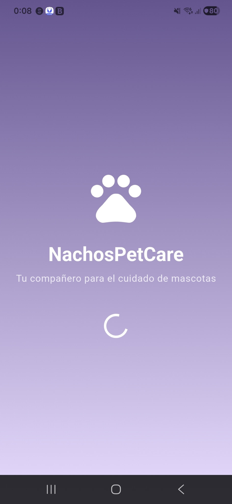
 </p>

---

### 🏠 Dashboard Principal

<p align="center">
  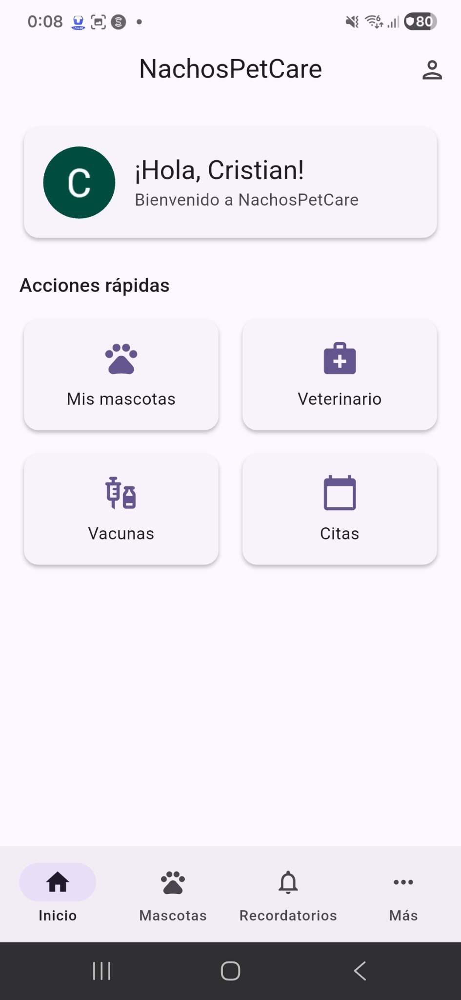
</p>

---

### 🐾 Gestión de Mascotas

#### 📋 Listado de Mascotas

<p align="center">
  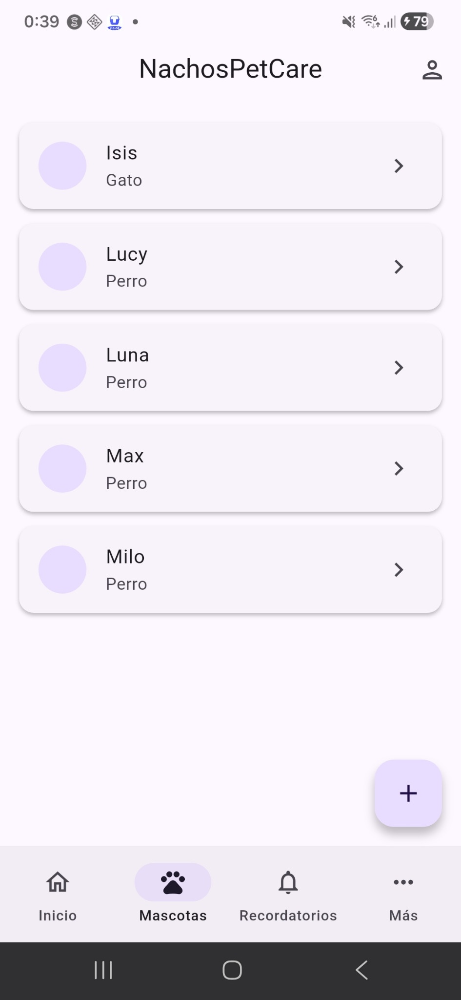
</p>

#### 🐶 Perfil de Mascotas

<p align="center">
  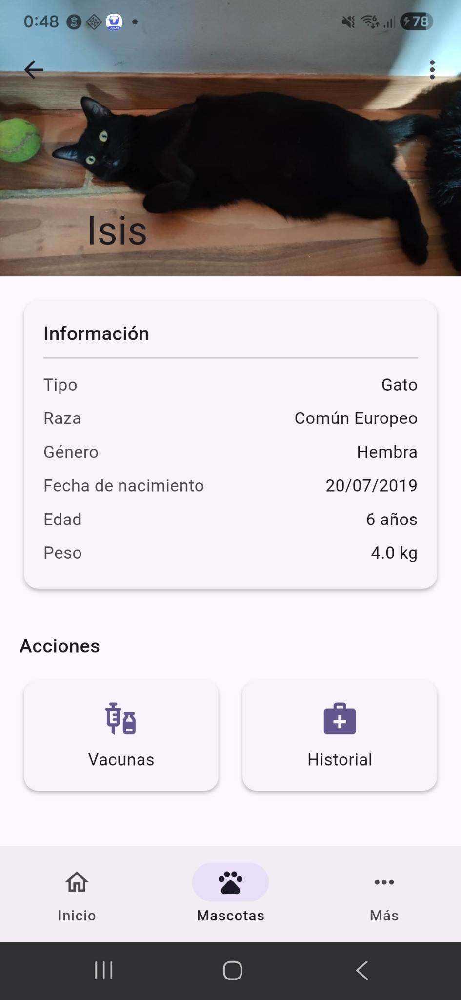
  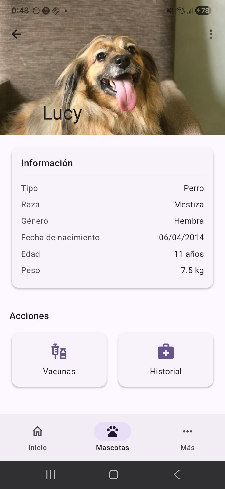
  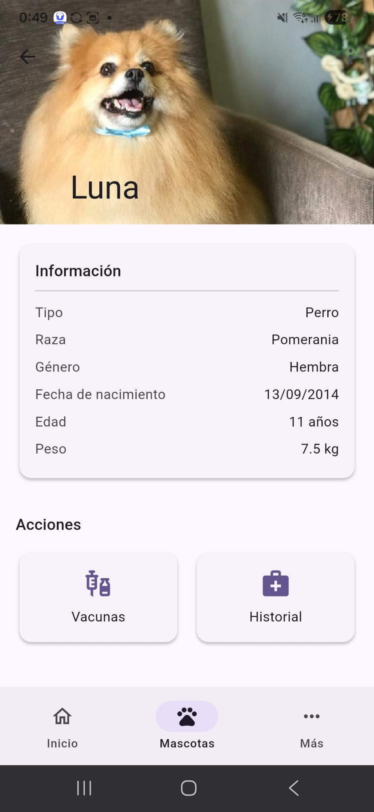
</p>

<p align="center">
  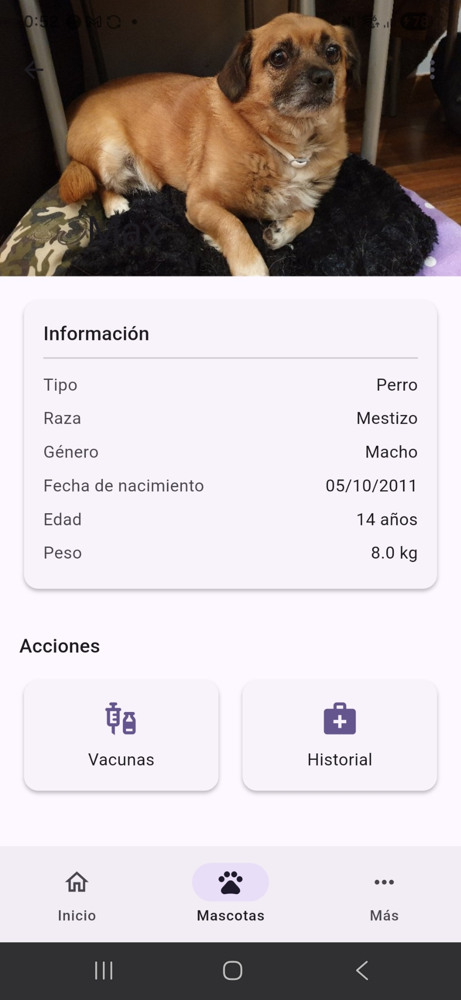
  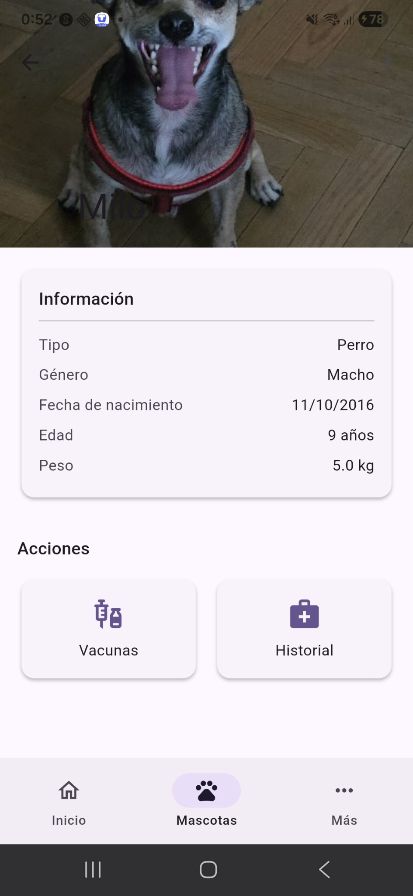
</p>

---

### 🔔 Recordatorios

<p align="center">
  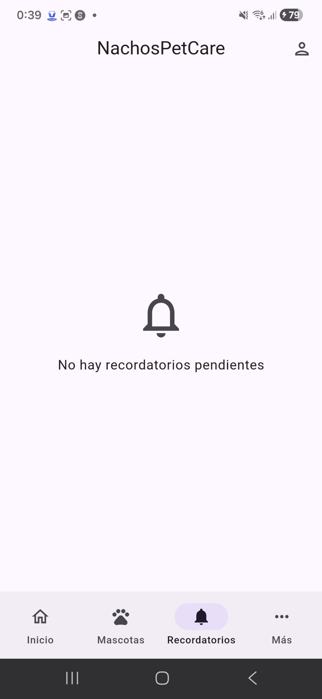
</p>

---

### 🌍 Comunidad y Directorio

#### 🐾 Comunidad

<p align="center">
  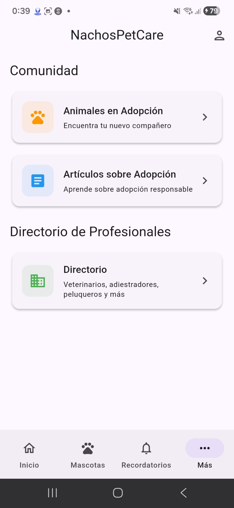
</p>

#### 🏡 Animales en Adopción

<p align="center">
  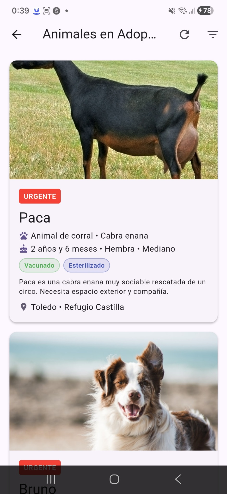
</p>

#### 📚 Artículos Informativos

<p align="center">
  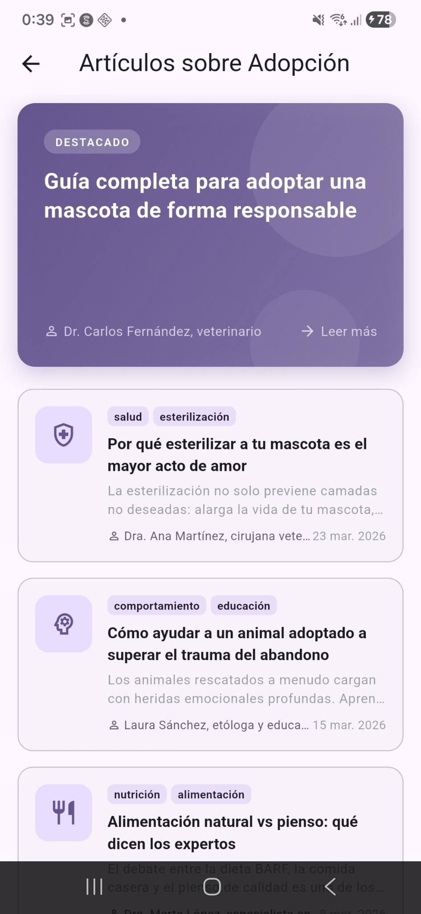
</p>

#### 🏥 Directorio Profesional

<p align="center">
  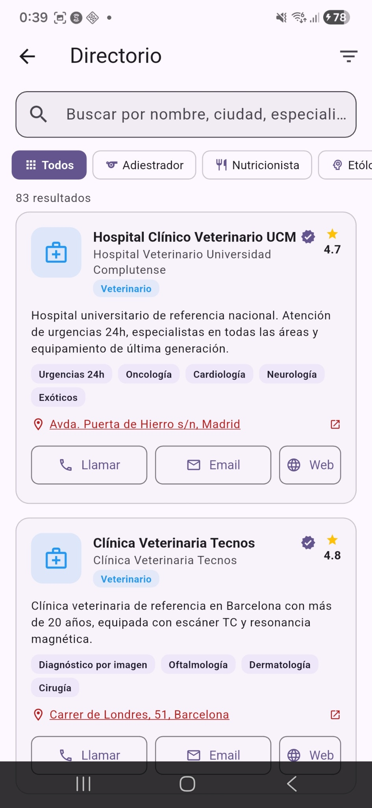
</p>

---

### 👤 Perfil y Configuración

<p align="center">
  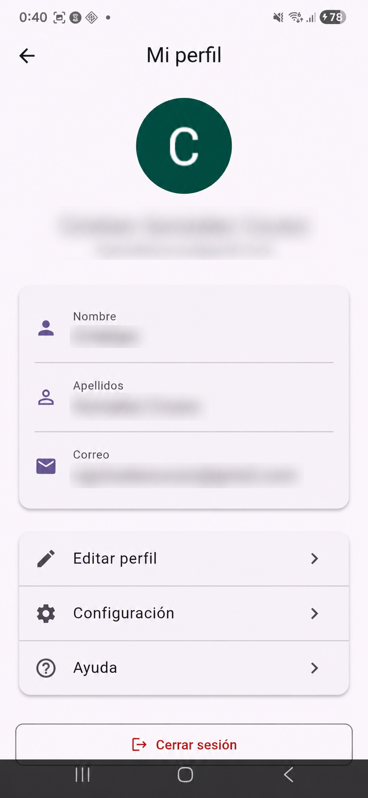
  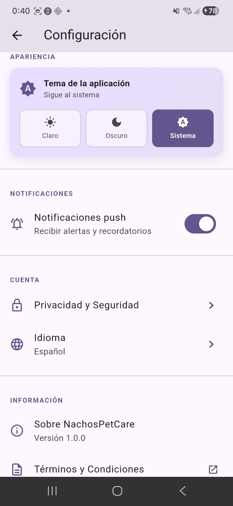
</p>

---

## 🎯 Descripción del Proyecto

**Nacho's PetCare** es un Trabajo de Fin de Grado del Ciclo Formativo de Grado Superior en **Desarrollo de Aplicaciones Multiplataforma (DAM)**, realizado en el curso 2025/26.

### Problema Identificado

En España hay más de **29 millones de mascotas registradas** y el sector mueve en torno a **1.500 millones de euros anuales**. Sin embargo, la gran mayoría de propietarios de animales de compañía continúa gestionando la información de manera fragmentada y analógica:

- 📓 Libretas veterinarias en papel
- 📱 Recordatorios perdidos en el calendario del teléfono
- 📸 Fotos dispersas entre diferentes aplicaciones
- 📄 Recetas y diagnósticos acumulados sin orden

**Consecuencias concretas:**
- ❌ Retrasos en vacunas y revisiones
- ❌ Seguimiento irregular de tratamientos y refuerzos
- ❌ Pérdida de historial médico al cambiar de veterinario
- ❌ Dificultad para compartir información clínica relevante

### Propuesta de Valor

Nacho's PetCare resuelve este problema ofreciendo:

✅ **Centralización completa** - Toda la información en un único lugar  
✅ **Multiplataforma nativa** - Android, iOS y escritorio (Windows, Linux, macOS)  
✅ **Funcionamiento offline** - Funciona sin conexión a internet  
✅ **Sincronización en la nube** - Tus datos siempre actualizados  
✅ **Funciones sociales** - Perfiles públicos, seguimiento y comentarios  
✅ **Experiencia internacional** - App disponible en varios idiomas  
✅ **Modelo freemium escalable** - Versión gratuita y suscripción Premium  

---

## 🛠️ Stack Tecnológico

### Frontend
[](https://flutter.dev)
[](https://dart.dev)

### Base de Datos
[](https://www.sqlite.org)
[](https://supabase.com)

### Backend & APIs
[](https://supabase.com)
[](https://firebase.google.com)
[](https://www.revenuecat.com)

### Plataformas Soportadas
[](https://www.android.com)
[](https://www.apple.com/ios)
[](https://www.microsoft.com/windows)
[](https://www.linux.org)
[](https://www.apple.com/macos)

### Herramientas de Desarrollo
- **IDE:** Android Studio / VS Code / IntelliJ IDEA
- **Control de versiones:** Git / GitHub
- **CI/CD:** GitHub Actions
- **Autenticación:** Firebase Authentication / Google Sign-In / Microsoft Authentication
- **Mensajería push:** Firebase Cloud Messaging (FCM)
- **Funciones backend:** Supabase Edge Functions
- **Suscripciones:** RevenueCat
- **Internacionalización:** ARB + localización personalizada
- **Documentos PDF:** Generación de informes y exportación documental
- **Widgets móviles:** App Widgets (Android) / WidgetKit (iOS)

---

## ✨ Características Principales

### v2.0 - Funcionalidades Incluidas

#### 👤 Gestión de Usuario
- ✅ Autenticación con email y contraseña
- ✅ Registro seguro de nuevas cuentas
- ✅ Login con Google Sign-In
- ✅ Autenticación con Microsoft
- ✅ Gestión de perfil de usuario
- ✅ Recuperación de contraseña
- ✅ Selector de idioma independiente del locale del dispositivo

#### 🐕 Gestión de Mascotas
- ✅ Registro y administración de mascotas
- ✅ Perfiles detallados por mascota (nombre, raza, edad, peso, etc.)
- ✅ Foto de perfil de cada mascota
- ✅ Galería de fotos independiente por mascota con registro de fechas
- ✅ Historial médico completo
- ✅ Perfil público de mascota compartible mediante URL única
- ✅ Galería pública opcional por mascota

#### 🏥 Historial Médico-Veterinario
- ✅ Registro de vacunas y fechas de aplicación
- ✅ Control de desparasitaciones
- ✅ Registro de visitas veterinarias
- ✅ Gestión de medicaciones y dosis
- ✅ Registro de diagnósticos y tratamientos
- ✅ Notas generales de salud
- ✅ Exportación del historial médico a PDF
- ✅ Generación de informe veterinario completo por mascota en PDF

#### 📅 Recordatorios y Notificaciones
- ✅ Recordatorios automáticos configurables
- ✅ Notificaciones push locales
- ✅ Notificaciones push remotas mediante Supabase Edge Functions + FCM
- ✅ Avisos de próximas citas
- ✅ Alertas de medicamentos
- ✅ Notificaciones enviadas desde otro dispositivo
- ✅ Recordatorios automáticos generados por el servidor
- ✅ Panel de administración de notificaciones

#### 📸 Gestión de Multimedia
- ✅ Subida de fotos desde cámara
- ✅ Importar fotos desde galería
- ✅ Álbum fotográfico por mascota separado del perfil
- ✅ Registro cronológico de fotografías
- ✅ Almacenamiento en la nube
- ✅ Comentarios en fotos

#### 🌍 Funcionalidades Sociales
- ✅ Perfiles públicos compartibles
- ✅ Seguimiento de mascotas de amigos
- ✅ Interacciones básicas mediante comentarios
- ✅ Galería pública opcional

#### 🌐 Internacionalización
- ✅ Soporte completo para español
- ✅ Soporte completo para inglés
- ✅ Soporte completo para portugués
- ✅ Soporte completo para francés
- ✅ Archivos ARB completos para todas las traducciones

#### 💳 Monetización Freemium
- ✅ Plan gratuito con hasta 2 mascotas
- ✅ Límite de 50 eventos históricos por mascota en plan gratuito
- ✅ Plan Premium por 3,99 €/mes
- ✅ Mascotas ilimitadas en Premium
- ✅ Exportación PDF incluida en Premium
- ✅ Sin límites de almacenamiento en Premium
- ✅ Gestión de suscripciones mediante RevenueCat

#### 📊 Panel de Control
- ✅ Vista resumen por mascota
- ✅ Próximos eventos y recordatorios
- ✅ Estadísticas de salud
- ✅ Registro de peso con gráfica temporal
- ✅ Visualización de evolución del peso mediante gráfica de línea
- ✅ Búsqueda y filtrado de registros

#### 📱 Experiencia Móvil Avanzada
- ✅ Widget de pantalla de inicio en Android
- ✅ Widget de pantalla de inicio en iOS
- ✅ Visualización del próximo evento de salud de la mascota prioritaria
- ✅ Acceso rápido a información esencial desde el escritorio del dispositivo

#### 🔄 Sincronización y Datos
- ✅ Funcionamiento completamente offline
- ✅ Sincronización automática en la nube
- ✅ Persistencia de datos local con SQLite
- ✅ Backup automático en Supabase
- ✅ Exportación de datos

### 🆕 Novedades de la versión 2.0

| Funcionalidad | Descripción |
|---|---|
| Modelo freemium | Plan gratuito con 2 mascotas y 50 eventos históricos por mascota; plan Premium por 3,99 €/mes con uso ilimitado. |
| Suscripciones con RevenueCat | Gestión centralizada del ciclo de vida de la suscripción, compras y validación de acceso Premium. |
| Perfil público de mascota | Cada mascota puede compartirse con una URL única para mejorar su visibilidad. |
| Galería pública opcional | Permite mostrar fotos públicamente según la configuración elegida por el usuario. |
| Seguir mascotas | Posibilidad de seguir mascotas de amigos dentro de la red social básica. |
| Comentarios en fotos | Interacción social mediante comentarios en imágenes publicadas. |
| Multiidioma completo | Soporte en español, inglés, portugués y francés mediante archivos ARB. |
| Idioma independiente del dispositivo | El usuario puede elegir manualmente el idioma desde ajustes sin depender del locale del sistema. |
| Push remotas avanzadas | Notificaciones remotas con Supabase Edge Functions + FCM y recordatorios automáticos generados por el servidor. |
| Panel de administración de notificaciones | Herramienta de gestión para controlar envíos y campañas de avisos. |

### 🆕 Novedades de la versión 3.0

| Funcionalidad | Descripción |
|---|---|
| Panel web B2B para clínicas veterinarias | Panel desarrollado con Flutter Web para gestión de pacientes animales, historias clínicas y usuarios internos. |
| Licencias SaaS por clínica | Modelo de suscripción por clínica a 49 €/mes con control de usuarios y permisos. |
| Invitación de veterinarios | Los propietarios pueden invitar a su veterinario para ver el historial médico de su mascota. |
| API REST pública | API para integraciones con clínicas, laboratorios, aseguradoras y otros servicios externos. |
| Wearables para mascotas | Integración con collares GPS y sensores de actividad mediante Bluetooth BLE + HTTP REST, con soporte para Tractive API y Fi Collar API. |
| Monitorización continua | Seguimiento de pasos/actividad diaria, patrón de sueño y frecuencia cardíaca cuando el wearable lo permite. |
| Historial sincronizado | Los datos de wearables se sincronizan y visualizan dentro del historial de cada mascota. |
| IA Asistente veterinario | Asistente basado en LLM accesible por API para analizar síntomas en texto libre. |
| Diagnósticos diferenciales | Sugerencias orientativas de diagnósticos diferenciales sin sustituir la valoración clínica. |
| Recomendaciones preventivas | Recomendaciones personalizadas de cuidado preventivo según perfil e historial de la mascota. |
| Marketplace integrado | Marketplace de productos para mascotas con integración con Amazon y tiendas especializadas mediante afiliación. |
| Recomendaciones personalizadas | Sugerencias por especie, raza, edad, peso, patologías, salud e historial de wearables. |
| Monetización por afiliación | Ingresos por comisiones entre 8% y 12% por compras realizadas desde la app. |

### 📦 Planes Disponibles

| Plan | Mascotas | Eventos históricos | Exportación PDF | Almacenamiento | Precio |
|---|---|---|---|---|---|
| Gratuito | Hasta 2 | 50 por mascota | No | Limitado | 0 €/mes |
| Premium | Ilimitadas | Ilimitados | Sí | Sin límites | 3,99 €/mes |

---

## 📋 Requisitos Previos

### Para Desarrollo

#### Windows
- **Flutter SDK:** 3.x o superior
- **Dart SDK:** 3.x o superior
- **Android Studio:** Última versión
- **Java JDK:** 17 o superior
- **Git:** 2.40 o superior
- **Visual Studio:** 2022 Community (para soporte desktop)
- **Espacio en disco:** Mínimo 10 GB

#### macOS
- **Xcode:** 14.0 o superior
- **Flutter SDK:** 3.x o superior
- **Dart SDK:** 3.x o superior
- **CocoaPods:** 1.11 o superior
- **Ruby:** 2.7 o superior

#### Linux
- **Flutter SDK:** 3.x o superior
- **Dart SDK:** 3.x o superior
- **CMake:** 3.10 o superior
- **pkg-config:** 0.29 o superior
- **GTK 3.0:** Development libraries

### Cuentas Necesarias

- 🔐 **Firebase Console** - Para autenticación y notificaciones FCM
- ☁️ **Supabase** - Para backend, sincronización y Edge Functions
- 💳 **RevenueCat** - Para la gestión de suscripciones Premium
- 📱 **Google Cloud Console** - Para Google Sign-In
- 🪟 **Microsoft Azure Portal** - Para autenticación con Microsoft
- 🔑 **Google Play Console** - Para publicar en Android
- 🍎 **Apple Developer Account** - Para iOS y widgets

---

## 🚀 Instalación y Configuración

## Instalación específica — Android

### Requisitos previos Android

- Android Studio instalado con Android SDK y emuladores configurados.
- Java JDK 17+ instalado y configurado en PATH.
- Flutter SDK instalado y disponible en PATH.

### 1. Clonar el Repositorio

```bash
git clone https://github.com/cgonzalezcouso/Nachos.PetCare.git
cd nachos_pet_care_flutter
```

### 2. Instalar Dependencias de Flutter

```bash
flutter pub get
```

### Construir y ejecutar en dispositivo o emulador

- Prepara un emulador o conecta un dispositivo físico con depuración USB.
- `flutter pub get`
- `flutter run -d <device-id>`
- También puedes ejecutar la app desde Android Studio con Run > Run 'app'.

### Generar APK / Bundle para publicar

- `flutter build apk --debug`
- `flutter build apk --release`
- `flutter build appbundle --release`
- Firma el bundle o APK siguiendo la guía oficial de Flutter mediante `key.properties` y `signingConfigs` en `build.gradle`.

## Instalación específica — Windows

### Requisitos previos Windows

- Visual Studio 2022 con la carga de trabajo Desktop development with C++ instalada.
- Flutter SDK en PATH con soporte para Windows habilitado.
- Espacio en disco mínimo 10 GB.

### Configuración específica

- Habilita Windows desktop en Flutter con `flutter config --enable-windows-desktop`.
- Verifica el entorno con `flutter doctor`.
- Asegúrate de que la carpeta `windows/` contiene los archivos del proyecto generados por Flutter.

### Construir y ejecutar en Windows localmente

- `flutter pub get`
- `flutter run -d windows`
- Para depurar, abre el proyecto `windows/` en Visual Studio y ejecútalo desde allí.

### Generar artefacto para distribución

- `flutter build windows --release`
- Empaqueta el contenido de `build/windows/runner/Release` con un instalador como MSIX, Inno Setup o NSIS.
- Firma el binario si vas a distribuirlo de forma oficial o quieres evitar advertencias de SmartScreen.

### 3. Configurar Firebase, Supabase, Microsoft Authentication y RevenueCat

#### Crear archivo `lib/config/secrets.dart`

```dart
class AppSecrets {
  static const String supabaseUrl = 'https://your-project.supabase.co';
  static const String supabaseAnonKey = 'your-anon-key';
  static const String googleWebClientId = 'your-web-client-id';
  static const String googleAndroidClientId = 'your-android-client-id';
  static const String microsoftClientId = 'your-microsoft-client-id';
  static const String microsoftTenantId = 'your-tenant-id';
  static const String revenueCatPublicKey = 'your-revenuecat-public-key';
}

final appSecrets = AppSecrets();
```

**⚠️ IMPORTANTE:** Este archivo NO debe ser commiteado. Está incluido en `.gitignore`.

### 4. Descargar `google-services.json`

1. Ve a [Firebase Console](https://console.firebase.google.com)
2. Selecciona tu proyecto
3. Descarga el archivo `google-services.json`
4. Colócalo en `android/app/google-services.json`

### 5. Configurar Edge Functions, FCM y RevenueCat

1. Crea las funciones necesarias en [Supabase](https://supabase.com)
2. Configura las credenciales de Firebase Cloud Messaging
3. Despliega las Edge Functions para el envío remoto de notificaciones
4. Configura productos, entitlements y offerings en RevenueCat
5. Verifica los tokens de dispositivo y la lógica de suscripción

### 6. Configurar internacionalización

1. Añade los archivos ARB en el directorio de localización
2. Verifica traducciones en español, inglés, portugués y francés
3. Activa el selector de idioma desde la pantalla de ajustes

---

## 🔧 Desarrollo Local

### Estructura del Proyecto

```text
nachos_pet_care_flutter/
├── lib/
│   ├── config/
│   │   ├── secrets.dart          # Configuración de credenciales (no commitar)
│   │   └── supabase_config.dart  # Configuración de Supabase
│   ├── l10n/                     # Archivos ARB y localización
│   ├── models/                   # Modelos de datos
│   ├── screens/                  # Pantallas de la aplicación
│   ├── services/                 # Servicios (API, BD, auth, suscripciones)
│   ├── widgets/                  # Widgets reutilizables
│   └── main.dart                 # Punto de entrada
├── supabase/                     # Edge Functions y lógica backend
├── android/                      # Configuración específica de Android
├── ios/                          # Configuración específica de iOS
├── windows/                      # Configuración específica de Windows
├── web/                          # Configuración para web
├── test/                         # Tests unitarios e integración
├── pubspec.yaml                  # Dependencias del proyecto
└── README.md                     # Este archivo
```

### Ejecutar en Modo Desarrollo

```bash
flutter run
flutter run -v
flutter run -d windows
flutter run -d chrome
```

### Análisis de Código

```bash
flutter analyze
dart format .
flutter analyze --suggestions
```

### Tests

```bash
flutter test
flutter test --coverage
flutter test test/unit/example_test.dart
```

---

## 🔐 Configuración de Credenciales

### Variables de Entorno Necesarias

```bash
SUPABASE_URL=https://your-project.supabase.co
SUPABASE_ANON_KEY=your-anon-key
GOOGLE_WEB_CLIENT_ID=your-web-client-id
GOOGLE_ANDROID_CLIENT_ID=your-android-client-id
MICROSOFT_CLIENT_ID=your-microsoft-client-id
MICROSOFT_TENANT_ID=your-tenant-id
FIREBASE_PROJECT_ID=your-project-id
FCM_SERVER_KEY=your-fcm-server-key
REVENUECAT_PUBLIC_KEY=your-revenuecat-public-key
```

### GitHub Secrets (para CI/CD)

Configura en tu repositorio GitHub:

1. **Settings → Secrets and variables → Actions**
2. Añade los siguientes secrets:

```text
SUPABASE_URL
SUPABASE_ANON_KEY
GOOGLE_WEB_CLIENT_ID
GOOGLE_ANDROID_CLIENT_ID
MICROSOFT_CLIENT_ID
MICROSOFT_TENANT_ID
GOOGLE_SERVICES_JSON
FCM_SERVER_KEY
REVENUECAT_PUBLIC_KEY
```

---

## 📊 Estructura de Datos

### Modelos Principales

#### Usuario
```dart
User {
  id: String,
  email: String,
  nombre: String,
  apellidos: String,
  fotoPerfil: String?,
  proveedorAuth: String,
  fechaRegistro: DateTime,
  ultimoAcceso: DateTime,
  localePreferido: String,
  isPremium: bool
}
```

#### Mascota
```dart
Pet {
  id: String,
  userId: String,
  nombre: String,
  raza: String,
  tipo: String,
  fechaNacimiento: DateTime,
  peso: double,
  color: String,
  foto: String?,
  microchip: String?,
  fechaRegistro: DateTime,
  esPrioritaria: bool,
  perfilPublico: bool,
  galeriaPublica: bool,
  publicSlug: String
}
```

#### Evento de Salud
```dart
HealthEvent {
  id: String,
  petId: String,
  tipo: String,
  fecha: DateTime,
  proximaFecha: DateTime?,
  descripcion: String,
  veterinario: String?,
  medicamento: String?,
  notas: String?
}
```

#### Comentario en Foto
```dart
PhotoComment {
  id: String,
  photoId: String,
  userId: String,
  content: String,
  createdAt: DateTime
}
```

#### Seguimiento Social
```dart
PetFollow {
  id: String,
  followerUserId: String,
  followedPetId: String,
  createdAt: DateTime
}
```

---

## 🌐 Sincronización en la Nube

### Supabase Setup

1. Crear proyecto en [Supabase](https://supabase.com)
2. Crear tablas:
   - `users`
   - `pets`
   - `health_events`
   - `weight_records`
   - `photos`
   - `photo_comments`
   - `pet_follows`
   - `device_tokens`
   - `subscriptions`

3. Configurar Row Level Security (RLS)
4. Obtener URL y anon key
5. Configurar `lib/config/secrets.dart`
6. Desplegar Edge Functions para notificaciones push remotas y recordatorios automáticos

### Funcionamiento Offline

- Los datos se guardan en **SQLite** localmente
- Cuando hay conexión, se sincronizan automáticamente con Supabase
- La aplicación funciona completamente sin internet

---

## 📈 Rendimiento y Escalabilidad

### Capacidades por plan

- **Gratuito:** hasta 2 mascotas y 50 eventos históricos por mascota
- **Premium:** mascotas, almacenamiento y eventos históricos ilimitados

### Beneficios de arquitectura v2.0

- Backend preparado para automatización de recordatorios
- Base social extensible para futuras funciones comunitarias
- Sistema de suscripción desacoplado mediante RevenueCat
- Localización ampliable a nuevos idiomas

---

## 📚 Documentación Adicional

- 📖 [Documentación de Flutter](https://flutter.dev/docs)
- 📖 [Documentación de Dart](https://dart.dev/guides)
- 📖 [Documentación de Supabase](https://supabase.com/docs)
- 📖 [Documentación de Firebase](https://firebase.google.com/docs)
- 📖 [Documentación de RevenueCat](https://www.revenuecat.com/docs)
- 📖 [Documentación de Microsoft Identity Platform](https://learn.microsoft.com/entra/identity-platform/)

---

## 👤 Autor

**Cristian Gonzalez Couso**

- 📧 Email: [cristian.gonzalez.couso@students.thepower.education](mailto:cristian.gonzalez.couso@students.thepower.education)
- 💼 LinkedIn: [Cristian Gonzalez Couso](https://www.linkedin.com/in/cristian-gonzalez-couso/)
- 🐙 GitHub: [@cgonzalezcouso](https://github.com/cgonzalezcouso)

---

## 👩‍🏫 Tutora

**Olga Moreno**

Tutora del Trabajo de Fin de Grado en el CFGS de Desarrollo de Aplicaciones Multiplataforma.

---

## 📜 Licencia

Este proyecto está bajo la licencia **MIT**. Ver archivo [LICENSE](LICENSE) para más detalles.

---

## 🙏 Dedicatoria

*"Dedicado a todas las mascotas que han pasado por mi vida, pero especialmente a Nacho, que me enseñó que fue un gran luchador hasta el final y que sé que donde esté me espera para reencontrarnos.*

*Para mi madre, que con todo su esfuerzo ha promovido que estudie y sea algo en la vida.*

*Por último, para mi compañera de vida que ha estado a mi lado y me ha animado a ir por el trabajo que quiero y seguir desarrollándome profesionalmente."*

---

## 🤝 Contribuciones

Las contribuciones son bienvenidas. Por favor:

1. Fork el repositorio
2. Crea una rama para tu feature (`git checkout -b feature/AmazingFeature`)
3. Commit tus cambios (`git commit -m 'Add some AmazingFeature'`)
4. Push a la rama (`git push origin feature/AmazingFeature`)
5. Abre un Pull Request

---

## 📞 Soporte

¿Encontraste un bug? ¿Tienes una sugerencia?

- 🐛 [Reportar bug](https://github.com/cgonzalezcouso/Nachos.PetCare/issues)
- 💡 [Solicitar feature](https://github.com/cgonzalezcouso/Nachos.PetCare/discussions)
- 📧 Contacta directamente al autor

---

**⭐ Si este proyecto te fue útil, considera darle una estrella en GitHub ⭐**

---

*Última actualización: Mayo 2026*  
*Versión: 2.0.0*
