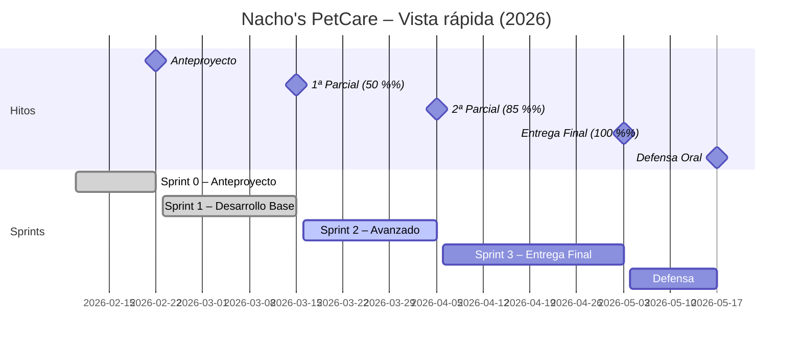

# Nacho’s PetCare 🐾 (Nachos.PetCare)

Aplicación Android desarrollada con **Flutter (Dart)** para registrar mascotas y su información sanitaria, gestionar recordatorios con notificaciones y centralizar recursos (adopción responsable, directorio profesional, sitios pet-friendly).

- Repositorio: https://github.com/cgonzalezcouso/Nachos.PetCare
- Autenticación: **Firebase Auth + Google Sign-In**
- Persistencia local: **SQLite (sqflite)**

---

## Índice
- [Resumen](#resumen)
- [Funcionalidades](#funcionalidades)
- [Tecnología](#tecnología)
- [Estructura del repositorio](#estructura-del-repositorio)
- [Requisitos](#requisitos)
- [Instalación y ejecución](#instalación-y-ejecución)
- [Configuración Firebase (Google Sign-In)](#configuración-firebase-google-sign-in)
- [Base de datos (borrador)](#base-de-datos-borrador)
- [Planificación (GitHub Projects)](#planificación-github-projects)
- [Documentación](#documentación)
- [Permisos y privacidad](#permisos-y-privacidad)
- [Licencia](#licencia)

---

## Resumen
**Nacho’s PetCare** permite a los usuarios:
- Iniciar sesión con Google (**Firebase Auth**).
- Añadir y gestionar **mascotas** con datos básicos (especie, nombre, foto, chip…).
- Guardar información sanitaria: **vacunas**, **enfermedades/condiciones**, **historial veterinario** e **informes**.
- Crear **recordatorios** (citas, vacunas, desparasitación) con **notificaciones**.
- Gestionar un **aviso de mascota perdida**.
- Consultar recursos: **adopción responsable**, directorio de profesionales y sitios **pet-friendly**.

**Especies soportadas** (catálogo):
Perro, Gato, Conejo, Roedor (hámster, cobaya, rata, ratón, jerbo, chinchilla), Hurón, Ave (periquito, canario, ninfa, agapornis, loro), Pez (agua dulce / marino), Reptil (tortuga, gecko, dragón barbudo, serpiente), Anfibio (axolote, rana, tritón), Invertebrado (tarántula, mantis, insecto palo, caracol), Animal de corral (gallina, pato, cabra/oveja, cerdo), Otro/Exótico (texto libre + aviso legal).

---

## Funcionalidades
### Núcleo
- ✅ Login/Logout con **Firebase Auth + Google Sign-In**
- ✅ CRUD de mascotas
- ✅ Persistencia local con **SQLite**
- ✅ Fotos desde cámara/galería
- ✅ Notificaciones locales para recordatorios

### Salud y documentación
- Vacunas: registro y próxima dosis
- Enfermedades/condiciones: diagnóstico + notas
- Historial veterinario: visitas y controles
- Informes veterinarios: adjuntar/gestionar documentos (local)

### Extra
- Mascota perdida: estado + contacto + ubicación (si aplica)
- Adopción responsable: listados/artículos
- Directorio: veterinarios, adiestradores, etólogos, peluqueros, nutricionistas…
- Sitios pet-friendly

---

## Tecnología
- **Flutter (Dart)**
- Android (Kotlin/AndroidX)
- **Firebase** (Auth + configuración Android)
- **SQLite** (`sqflite`)
- Preferencias (`shared_preferences`)
- Permisos (p. ej. `permission_handler`)
- Multimedia (p. ej. `image_picker`)
- Utilidades (`path_provider`, `url_launcher`)
- Notificaciones (p. ej. `flutter_local_notifications`)

> Paquetes exactos en `pubspec.yaml`.

---

## Estructura del repositorio
```text
.github/
  ISSUE_TEMPLATE/   ← plantillas Kanban (historia, bug, tarea)
  workflows/        ← CI/CD + automatización del tablero
.vscode/
android/
assets/
docs/
  architecture.md   ← diagrama de arquitectura (Mermaid)
  er.md             ← modelo de datos ER (Mermaid)
  kanban.md         ← metodología y flujo del tablero Kanban
  plan.md           ← diagrama de Gantt + backlog por sprint
ios/
lib/
linux/
macos/
test/
web/
windows/
pubspec.yaml
```

---

## Requisitos

- Flutter ≥ 3.x (canal `stable`)
- Dart ≥ 3.x
- Java 17 (para build Android)
- Android SDK (API 21+)
- Cuenta de Firebase con proyecto configurado

---

## Instalación y ejecución

```bash
# 1. Clonar el repositorio
git clone https://github.com/cgonzalezcouso/Nachos.PetCare.git
cd Nachos.PetCare

# 2. Instalar dependencias
flutter pub get

# 3. Análisis estático
flutter analyze

# 4. Ejecutar tests
flutter test

# 5. Lanzar en dispositivo/emulador Android
flutter run
```

---

## Configuración Firebase (Google Sign-In)

1. Crea un proyecto en [Firebase Console](https://console.firebase.google.com/).
2. Añade una app Android con el package name `com.example.nachos_pet_care_flutter`.
3. Descarga `google-services.json` y colócalo en `android/app/`.
4. Activa **Authentication → Google** en la consola de Firebase.
5. (Opcional) Activa **Firestore** o **Realtime Database** si deseas sincronización en la nube.

---

## Base de datos (borrador)

El modelo de datos completo está en [`docs/er.md`](docs/er.md).

Tablas principales (SQLite local):
- `users` – perfil del usuario autenticado
- `pets` – mascotas del usuario
- `vaccinations` – registro de vacunas por mascota
- `medical_events` – historial médico (visitas, enfermedades, tratamientos)
- `reminders` – recordatorios con notificación
- `lost_reports` – avisos de mascota perdida
- `adoption_listings` – publicaciones de adopción

---

## Planificación (GitHub Projects)

> 🗂️ **[Tablero Kanban → GitHub Projects](https://github.com/users/cgonzalezcouso/projects/10)** _(requiere acceso al proyecto si es privado)_

El proyecto sigue una metodología **híbrida Scrum + Kanban**:

| Sprint | Período | Entrega | Estado |
|--------|---------|---------|--------|
| Sprint 0 | 10/02 – 22/02 | Anteproyecto | ✅ Completado |
| Sprint 1 | 23/02 – 15/03 | 1ª Parcial (50 %) | ✅ Completado |
| Sprint 2 | 16/03 – 05/04 | 2ª Parcial (85 %) | 🔄 En curso |
| Sprint 3 | 06/04 – 03/05 | Entrega Final (100 %) | ⏳ Pendiente |
| Defensa  | 04/05 – 17/05 | Defensa oral | ⏳ Pendiente |

📊 **Diagrama de Gantt completo:** [`docs/plan.md`](docs/plan.md)
🗂️ **Metodología Kanban y flujo de trabajo:** [`docs/kanban.md`](docs/kanban.md)



---

## Documentación

| Archivo | Contenido |
|---------|-----------|
| [`docs/plan.md`](docs/plan.md) | Gantt detallado + backlog completo por sprint |
| [`docs/kanban.md`](docs/kanban.md) | Metodología Scrum + Kanban y reglas del tablero |
| [`docs/architecture.md`](docs/architecture.md) | Diagrama de arquitectura y flujo de la aplicación |
| [`docs/er.md`](docs/er.md) | Modelo entidad-relación de la base de datos |

---

## Permisos y privacidad

La aplicación puede solicitar los siguientes permisos en Android:
- **Cámara** – para tomar fotos de las mascotas.
- **Almacenamiento** – para acceder a la galería de fotos.
- **Notificaciones** – para recordatorios de vacunas y citas.
- **Ubicación** (opcional) – para el módulo de mascota perdida.

Todos los datos se almacenan **localmente** en el dispositivo (SQLite). La autenticación se gestiona de forma segura a través de **Firebase Auth**.

---

## Licencia

Este proyecto es de uso académico. Todos los derechos reservados © 2026 cgonzalezcouso.
